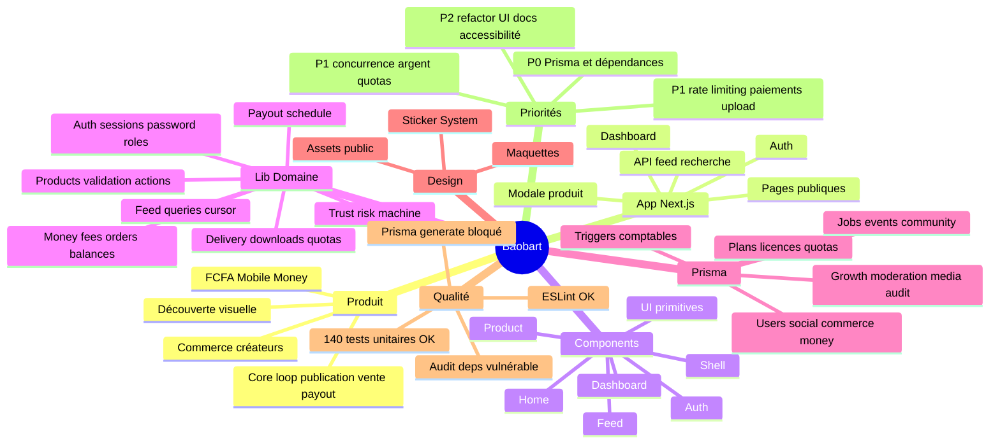

# Audit complet du projet Baobart

**Date d'audit : 2026-08-21**  
**Branche auditée : `arena/01a0261e-baobart`**  
**Dépôt : `auceps-dev-team/Baobart`**

Cet audit a été réalisé après lecture systématique du dépôt : code applicatif, composants, domaine métier, schéma Prisma, migrations, tests, scripts, configuration, documentation produit et inventaire des assets/maquettes. Les dossiers générés ou externes (`.git`, `node_modules`, caches Next/TS) ne font pas partie du périmètre fonctionnel audité.

Artefact graphique associé : [`Doc/CARTE_MENTALE_BAOBART.svg`](./CARTE_MENTALE_BAOBART.svg)  
Source Mermaid associée : [`Doc/CARTE_MENTALE_BAOBART.mmd`](./CARTE_MENTALE_BAOBART.mmd)

---

## 1. Synthèse exécutive

Baobart est un **socle Next.js / Prisma / Postgres** pour une marketplace créative africaine : découverte visuelle type Pinterest, portfolios type Dribbble, vente de ressources type Gumroad, paiement en FCFA/Mobile Money, protection des créations et versements créateurs.

Le dépôt est aujourd'hui à un stade **M0/M1 avancé côté socle métier**, avec :

- une documentation produit dense et cohérente ;
- un schéma de données très riche : **67 modèles Prisma** et **29 enums** ;
- des décideurs métier purs bien testés : frais, livraison, trust, payouts, navigation, validation produit, mots de passe, formatage monétaire ;
- une UI Next.js déjà structurée : accueil, exploration, auth, dashboard, fiches produit, modale interceptée ;
- des garde-fous comptables en base via triggers Postgres ;
- des tests unitaires nombreux et lisibles.

Mais le projet n'est pas encore prêt pour une mise en production réelle, principalement à cause de :

1. **Blocage de génération Prisma dans l'environnement d'audit** : `pnpm db:generate` échoue sur le téléchargement des binaires Prisma, ce qui bloque typecheck/build complets.
2. **Vulnérabilités de dépendances signalées par `pnpm audit`** : 7 vulnérabilités, dont 5 high.
3. **Modules critiques encore absents ou incomplets** : paiement réel, webhooks, upload S3 signé, emails, workers/jobs, admin, checkout, API de téléchargement publique.
4. **Risque de concurrence sur l'argent et les quotas** : plusieurs transactions lisent puis écrivent sans verrou conditionnel suffisant.
5. **Sécurité d'exploitation à compléter** : rate limiting, audit applicatif, validation d'origin/abus API, politiques de session avancées.

---

## 2. Inventaire vérifié

### 2.1 Fichiers et volumes

Inventaire hors `.git` et `node_modules` au moment de l'audit :

| Élément | Volume |
|---|---:|
| Fichiers audités | 215 |
| Taille totale hors dépendances | ~181,6 MB |
| Code TypeScript/TSX/MJS/SQL/Prisma/CSS principal | ~15 644 lignes pour app/components/lib/prisma/scripts |
| Modèles Prisma | 67 |
| Enums Prisma | 29 |
| Tests unitaires exécutés et passés | 140 |
| Dossiers de documentation produit | 15 fichiers dans `Doc/` |
| Maquettes/assets design | 80 fichiers dans `Baobart Design/` |

Répartition importante :

- `app/` : routes Next App Router.
- `components/` : UI et shells.
- `lib/` : domaine métier, auth, feed, produits, paiements, trust.
- `prisma/` : schéma, migrations, seeds et tests SQL.
- `Doc/` : specs produit et architecture.
- `Baobart Design/` : maquettes `.dc.html` et assets de référence.
- `public/img/` : assets exposés par l'app.

### 2.2 Commandes exécutées

| Commande | Résultat | Commentaire |
|---|---|---|
| `corepack enable && corepack prepare pnpm@10.33.2 --activate` | OK | Activation du gestionnaire déclaré. |
| `pnpm install --frozen-lockfile` | OK | Installation reproductible. |
| `pnpm db:generate` | Échec | Téléchargement des binaires Prisma impossible : socket TLS coupée vers `binaries.prisma.sh`. |
| `pnpm typecheck` | Échec | Majoritairement conséquence du client Prisma non généré ; quelques erreurs TS indépendantes possibles sont à revalider après génération. |
| `pnpm lint` | OK | ESLint passe. |
| `pnpm test:unite` | 8 fichiers OK, 1 suite bloquée | 140 tests passés ; `lib/auth/roles.test.ts` échoue car `@prisma/client` n'est pas généré. |
| `docker --version` | Échec | Docker absent dans l'environnement ; tests intégration DB non exécutables ici. |
| `pnpm audit --audit-level moderate` | Échec sécurité | 7 vulnérabilités détectées. |

### 2.3 Limite de certitude

Je peux affirmer avoir parcouru l'intégralité du dépôt visible et vérifié la structure, la cohérence, les chemins critiques et les commandes disponibles. En revanche, je ne peux pas certifier un build/runtime complet tant que :

- Prisma ne peut pas générer son client ;
- une base Postgres réelle n'est pas disponible ;
- les tests d'intégration ne peuvent pas tourner.

---

## 3. Architecture fonctionnelle

### 3.1 Vision produit

Le produit est articulé autour du **core loop** suivant :

1. Un utilisateur découvre des créations dans un feed visuel.
2. Il ouvre une ressource en fiche complète ou en modale interceptée.
3. Il télécharge/achète selon achat unitaire ou abonnement.
4. Un créateur publie une ressource depuis son dashboard.
5. Les ventes alimentent un solde journalier.
6. Les versements sont projetés selon rail/fréquence.
7. La confiance, les badges et la découverte éditoriale renforcent la boucle.

### 3.2 Stack

| Couche | Choix actuel |
|---|---|
| Framework | Next.js 15 App Router |
| React | React 19 |
| Langage | TypeScript strict |
| ORM | Prisma 6 |
| DB | Postgres |
| UI | CSS global + Tailwind v4 tokens + styles inline nombreux |
| Tests | Vitest projets `unite` et `integration` |
| Infra dev | Docker Compose : Postgres, Redis, MinIO |
| Déploiement | Dockerfile standalone conditionnel via `BUILD_STANDALONE=1` |

---

## 4. Cartographie du code

### 4.1 `app/` — routes Next.js

| Route/fichier | Rôle | État |
|---|---|---|
| `app/page.tsx` | Accueil dynamique : header, hero, catégories, feed, sections, footer | Fonctionnel côté lecture DB. |
| `app/explore/page.tsx` | Exploration filtrée avec rail latéral et feed | Fonctionnel. |
| `app/products/[slug]/page.tsx` | Fiche produit page complète | Fonctionnel. |
| `app/@modal/(.)products/[slug]/page.tsx` | Fiche produit en modale interceptée | Bonne utilisation App Router. |
| `app/api/feed/route.ts` | Pagination du feed en JSON | Fonctionnel, sans rate limiting. |
| `app/api/recherche/route.ts` | Suggestions de recherche | Fonctionnel, sans limite forte côté entrée/rate limiting. |
| `app/connexion/page.tsx` | Connexion | Fonctionnel. |
| `app/inscription/page.tsx` | Inscription | Fonctionnel. |
| `app/mot-de-passe-oublie/page.tsx` | Réinitialisation annoncée mais non implémentée email | Intentionnellement partiel. |
| `app/dashboard/page.tsx` | Aperçu dashboard | Fonctionnel. |
| `app/dashboard/produits/*` | Liste, création, détail produits vendeur | Fonctionnel en base, UX encore simple. |

### 4.2 `components/` — interface

| Zone | Fichiers | Observations |
|---|---|---|
| Shell | `header`, `footer`, `rail`, `nav-data` | Identité visuelle forte, recherche client, navigation. |
| Home | `hero`, `home-shell`, `sections` | Beaucoup de styles inline ; composant `sections.tsx` très volumineux (~960 lignes). |
| Feed | `feed`, `resource-card` | Chargement client par API, filtres, masonry CSS. |
| Auth | `auth-form`, `auth-shell` | Formulaire client avancé, providers déclaratifs. |
| Dashboard | `sidebar`, `product-form` | Progression acheteur → atelier → boutique. |
| Product | `detail`, `modal` | Fiche ressource détaillée. |
| UI | `button`, `card`, `input`, `pill` | Base reusable légère. |

### 4.3 `lib/` — domaine métier

| Domaine | Fichiers | Points forts |
|---|---|---|
| Auth | `actions`, `password`, `session`, `providers`, `roles`, `strength` | scrypt, cookie httpOnly, token DB hashé, progression claire. |
| Feed | `queries`, `types` | Séparation client/server, curseur composite, filtres famille. |
| Produits | `actions`, `queries`, `validation` | Brouillon puis publication, validation pure testée, tags connectOrCreate. |
| Argent | `fees`, `orders`, `balances` | Frais entiers, ledger, solde journalier, remboursement partiel. |
| Livraison | `delivery`, `downloads` | Décision d'accès pure, quotas, URL signée selon taille. |
| Trust | `trust` | Machine de risque, hystérésis low balance. |
| Payouts | `payout-schedule` | Cycles UTC, date de cycle distincte de date de versement. |
| i18n | `money` | Montants entiers, format FR/XOF. |
| Dashboard | `nav` | Navigation progressive très claire. |

---

## 5. Modèle de données Prisma

### 5.1 Envergure

Le schéma Prisma couvre déjà un produit ambitieux :

- Auth/utilisateurs : `User`, `Profile`, `BillingInfo`, `Session`, `Account`, `Passkey`, `TeamMembership`.
- Social visuel : `WorkItem`, `WorkImage`, `Tag`, `Like`, `Comment`, `Board`, `Save`, `Follow`.
- Commerce : `Product`, `ProductFile`, `Variant`, `Cart`, `Order`, `OrderItem`, `Refund`.
- Argent : `Balance`, `BalanceTransaction`, `Payout`, `ExchangeRate`, `MobileMoneyAccount`.
- Monétisation : `Plan`, `Subscription`, `DownloadQuota`, `ConsumptionEvent`, `LicenseType`, `LicenseKey`, revenue pool.
- Gamification : `Badge`, `UserBadge`.
- Jobs/services/events : `JobPosting`, `Event`, `Commission`, `Call`.
- Communauté : `Community`, forum, chat, notifications.
- Croissance : affiliation, codes promo, upsells, posts/newsletters.
- Sécurité/modération/audit : blocked objects, risk state changes, moderation/fraud/audit logs.
- Médias : `MediaAsset`, `UploadReservation`.

### 5.2 Bonnes décisions observées

- Montants en `Int`, jamais en flottant.
- Index composites `(createdAt, id)` pour pagination curseur.
- Compteurs dénormalisés prévus.
- Distinction `OrderStatus` et `PurchaseState` au niveau ligne.
- Remboursement représenté par `Refund`, pas par un statut unique.
- Solde journalier par `(userId, date, holdingCurrency)`.
- Grand livre `BalanceTransaction` avec devises issued/holding.
- Triggers Postgres pour immutabilité et soldes figés.

### 5.3 Points de vigilance schéma

| Priorité | Sujet | Risque | Recommandation |
|---|---|---|---|
| P0 | Client Prisma non généré | Typecheck/build/tests intégration bloqués | Résoudre accès binaires Prisma ou vendor/cache engines en CI. |
| P1 | Relations volontairement scalaires pour modules futurs | Perte d'intégrité DB sur jobs/events/commissions/croissance | Ajouter FK réelles au fur et à mesure des modules construits. |
| P1 | `Save` avec `workItemId?` et `productId?` | Rien n'empêche les deux `null` ou les deux remplis | Ajouter contrainte CHECK Postgres. |
| P1 | `BalanceTransaction` origine exactement une référence | Commentaire indique une règle, mais pas de contrainte DB | Ajouter CHECK `(orderItemId, refundId, payoutId)` exactement une origine selon type. |
| P1 | `AuditLog.actorId` obligatoire mais sans relation | Système admin futur risque d'écrire des acteurs inexistants | Clarifier relation User/admin/service account. |
| P2 | `status String` sur plusieurs modèles | Moins sûr que des enums | Remplacer progressivement par enums. |

---

## 6. Qualité, tests et maintenabilité

### 6.1 Ce qui est solide

- Les décideurs purs sont très bien isolés et testés.
- Les commentaires expliquent les invariantes métier, pas seulement le code.
- Les tests unitaires couvrent des cas limites importants : prix, frais, payouts, trust, livraison, mots de passe.
- La configuration Vitest sépare unitaires et intégration.
- ESLint passe.
- `server-only` est utilisé pour éviter Prisma côté client.

### 6.2 Ce qui fragilise

- TypeScript strict ne passe pas dans l'environnement actuel sans client Prisma.
- Certains tests unitaires importent indirectement `db` (`roles.test.ts`) et ne sont donc pas vraiment purs.
- Plusieurs composants UI dépassent 300–900 lignes avec beaucoup de styles inline : maintenance difficile.
- `next.config.ts` autorise `images.remotePatterns` sur `https://**`, pratique mais trop large en production.
- Pas de couverture mesurée (`coverage/` ignoré mais pas de commande dédiée).

### 6.3 Erreurs TypeScript vues pendant l'audit

Comme `prisma generate` a échoué, beaucoup d'erreurs viennent de types Prisma absents (`Currency`, `ProductFamily`, etc.). À revalider après génération. Les erreurs observées incluent aussi :

- paramètres implicites `any` dans plusieurs mappings ;
- `lib/db.ts` : event de query non typé ;
- `lib/products/queries.ts` : `famille` possiblement `undefined` au lieu de `null`.

---

## 7. Sécurité

### 7.1 Points positifs

- Mot de passe : scrypt avec salt et format paramétré.
- Vérification login constante même quand le compte est absent.
- Sessions : token aléatoire 32 octets, stockage DB uniquement en SHA-256.
- Cookie `httpOnly`, `sameSite=lax`, `secure` en production.
- Suspension compte prise en compte à la lecture de session.
- Suppression/modification produit vérifie l'appartenance vendeur.
- Garde-fous SQL sur comptabilité.

### 7.2 Vulnérabilités dépendances

`pnpm audit --audit-level moderate` signale :

| Sévérité | Package | Chemin | Remarque |
|---|---|---|---|
| high | `sharp` | via `next` | CVE libvips, patch `sharp >=0.35.0`. |
| high/moderate | `postcss` | via `next` | Plusieurs advisory source map / XSS stringify. |
| high | `nanoid` | via `@tailwindcss/postcss > postcss` | Patch `>=3.3.18`. |
| high | `deepmerge-ts` | via `prisma > @prisma/config` | Patch `>=8.0.0`. |

Action recommandée : mettre à jour Next/Tailwind/Prisma vers versions qui remontent ces transitives patchées, puis relancer audit + build.

### 7.3 Risques applicatifs

| Priorité | Sujet | Risque | Recommandation |
|---|---|---|---|
| P1 | APIs `/api/feed` et `/api/recherche` sans rate limit | Scraping, charge DB, abus recherche | Ajouter middleware rate limit IP/session + limite q/cursor. |
| P1 | Recherche `contains insensitive` sans index trigram | Lenteur sur catalogue réel | Index GIN trigram ou moteur search dédié. |
| P1 | Inscription sans CAPTCHA/limiteur | Création massive comptes | Rate limit + honeypot/CAPTCHA adaptatif. |
| P1 | Sessions sans rotation périodique | Jeton 30 jours stable | Rotation à activité, révocation par device, audit session. |
| P2 | `remotePatterns` images trop large | Surface SSR/image proxy plus grande | Restreindre aux CDN/S3 connus. |
| P2 | `.env.example` contient doublons de variables auth | Confusion déploiement | Dédupliquer et aligner noms specs/code. |

---

## 8. Argent, paiements et concurrence

### 8.1 Points forts

Le domaine argent est l'une des parties les mieux pensées :

- frais déterministes en entiers ;
- régime `DIRECT` vs `DECOUVERTE` ;
- pas de frais fixes sur gratuit ;
- ligne d'achat indépendante ;
- remboursement partiel ;
- solde journalier ;
- ledger immuable ;
- devise d'encaissement séparée de devise de détention ;
- projections de payout par rails.

### 8.2 Risques critiques

| Priorité | Fichier | Problème | Impact | Correctif recommandé |
|---|---|---|---|---|
| P1 | `lib/domain/orders.ts` | `encaisserLigne` lit `state`, puis update sans condition atomique | Double encaissement possible en concurrence | `updateMany({ where: { id, state: IN_PROGRESS } })`, isolation serializable ou verrou SQL. |
| P1 | `lib/domain/orders.ts` | `rembourserLigne` ne vérifie pas explicitement que la ligne est `SUCCESSFUL`/`NOT_CHARGED` | Remboursement possible sur ligne non encaissée selon appelant | Bloquer états non remboursables. |
| P1 | `lib/domain/orders.ts` | Remboursements concurrents lisent le même `refundedAmount` | Sur-remboursement possible | Update conditionnel `refundedAmount <= encaisse - amount` ou verrou ligne. |
| P1 | `lib/domain/downloads.ts` | Quota lu puis incrémenté sans condition | Dépassement de quota en concurrence | Update conditionnel `used < limit`, ou transaction serializable. |
| P1 | `lib/products/actions.ts` | Slug unique vérifié avant create | Collision race possible | Catch contrainte unique et retry. |
| P2 | `lib/domain/balances.ts` | `Promise.all` dans une transaction Prisma pour update + create | Lisibilité/ordre ; Prisma sérialise souvent mais ce n'est pas nécessaire | Exécuter séquentiellement pour auditabilité. |

---

## 9. Fonctionnalités présentes vs absentes

### 9.1 Présentes dans le code

- Accueil dynamique.
- Feed paginé par curseur.
- Filtres par familles produit.
- Recherche de produits publiée.
- Auth email/mot de passe.
- Inscription avec profil + billing.
- Dashboard progressif.
- Création de brouillon produit.
- Publication/dépublication/suppression contrôlée.
- Fiche produit publique/modale.
- Seeds plans/licences/badges + données démo.
- Décideurs métier : frais, livraison, trust, payout schedule.

### 9.2 Présentes dans le schéma/specs mais pas encore dans l'app

- Checkout complet.
- Passerelles Mobile Money/carte et webhooks.
- Génération réelle de license keys.
- Upload direct S3/MinIO + pipeline Shield.
- Téléchargement avec URL signée exposé par route/API.
- Notifications et emails transactionnels.
- Workers/jobs async.
- Admin/modération/CMS.
- Communautés/forum.
- Affiliations/codes promo/upsells.
- Analytics créateur.
- API publique/intégrations Figma/Canva/Framer.
- Paiements/payouts réels.

---

## 10. Design system et UI

### 10.1 Cohérence

Le design system est clairement défini :

- couleurs : lavande fond/clair/profond, jaune, orange, orange sombre, encre, blanc ;
- typo : Archivo Black, Poppins, Space Mono ;
- contours forts ;
- ombres dures 45° ;
- interactions type sticker ;
- rail latéral, cartes, pastilles.

### 10.2 Risques UI

| Priorité | Sujet | Risque | Recommandation |
|---|---|---|---|
| P2 | Styles inline massifs | Difficile de refactorer, tester responsive/accessibilité | Extraire composants/tokens CSS ou classes Tailwind utilitaires. |
| P2 | Composants longs | Régressions faciles | Découper `sections.tsx`, `header.tsx`, `auth-form.tsx`, `detail.tsx`. |
| P2 | Accessibilité | Certaines zones interactives personnalisées à vérifier manuellement | Audit clavier/screen reader, labels, aria-expanded, focus trap modal. |
| P2 | Images | Beaucoup d'assets lourds dans repo | Conserver seulement démo utile ; déplacer grosses sources hors Git si nécessaire. |

---

## 11. Documentation

### 11.1 Points forts

La documentation est exceptionnellement riche pour un socle :

- plan directeur Gumroad/Baobart ;
- blueprint Next.js ;
- design system ;
- specs admin/CMS ;
- auth/intégrations ;
- Shield ;
- gamification ;
- licences ;
- livraison/previews/assets ;
- produits physiques ;
- déploiement/self-hosting ;
- vérification Gumroad.

### 11.2 Points à surveiller

- Certaines décisions commerciales restent ouvertes dans les commentaires/code : taux de commission, seuils payout, jours rail.
- Les specs dépassent largement le code livré : risque d'écart si une matrice "spec → implémentation" n'est pas maintenue.
- `.env.example` contient des doublons d'auth providers.

Recommandation : ajouter un fichier `Doc/MATRICE_IMPLEMENTATION.md` avec colonnes : spec, module, statut, route, tests, dette.

---

## 12. Déploiement et exploitation

### 12.1 Ce qui existe

- `Dockerfile` multi-stage avec `next standalone`.
- `docker-compose.yml` dev : Postgres, Redis, MinIO.
- `.env.example` 12-factor.
- Scripts Prisma et tests.
- Slow query logging côté Prisma et Postgres dev.

### 12.2 Manques avant production

| Priorité | Sujet | Recommandation |
|---|---|---|
| P0 | Prisma generate reproductible | Précharger/cache les engines Prisma en CI ou corriger accès réseau. |
| P0 | Dépendances vulnérables | Upgrade et audit clean. |
| P1 | Migrations en CI | `prisma migrate deploy` sur DB éphémère. |
| P1 | Tests intégration | Postgres CI obligatoire. |
| P1 | Observabilité | Sentry/log structuré + métriques jobs/paiements. |
| P1 | Sauvegardes | Procédure DB + médias testée. |
| P1 | Secrets | Gestion par plateforme, jamais valeurs prod en repo. |
| P2 | Healthchecks app/worker | Ajouter endpoints de santé. |

---

## 13. Priorités recommandées

### P0 — Stabiliser la base technique

1. Résoudre `prisma generate` et régénérer le client.
2. Relancer `pnpm typecheck`, `pnpm build`, `pnpm test`, tests intégration avec Postgres.
3. Corriger les vulnérabilités `pnpm audit`.
4. Verrouiller versions dépendances critiques si nécessaire.

### P1 — Sécuriser les flux critiques

1. Rendre encaissements/remboursements/quotas atomiques en concurrence.
2. Ajouter contraintes CHECK DB pour invariantes non exprimables Prisma.
3. Ajouter rate limiting sur auth, recherche, feed, futures routes checkout/download.
4. Implémenter upload S3 signé et téléchargement signé derrière autorisation.
5. Implémenter paiement/webhooks avec idempotence.
6. Ajouter tests d'intégration pour races argent/quota.

### P2 — Maintenabilité et produit

1. Découper gros composants UI.
2. Extraire styles inline répétitifs vers primitives/classes.
3. Ajouter matrice specs → implémentation.
4. Restreindre domaines images.
5. Ajouter audit accessibilité.
6. Nettoyer `.env.example`.

---

## 14. Carte mentale intégrée Mermaid

---

## 15. Conclusion

Baobart possède une base conceptuelle et métier très supérieure à un prototype classique : le domaine argent, les règles de livraison, le trust, la progression créateur et la documentation montrent une vraie conception produit. La priorité n'est pas de "rajouter des écrans" immédiatement ; elle est de **fiabiliser la chaîne technique et les invariantes critiques** pour que les futures fonctionnalités reposent sur un socle sûr.

Ordre conseillé pour les prochaines modifications :

1. débloquer Prisma/build/tests ;
2. corriger vulnérabilités dépendances ;
3. sécuriser concurrence argent/quota ;
4. implémenter upload + téléchargement signé ;
5. implémenter checkout + webhooks idempotents ;
6. seulement ensuite étendre admin, communauté, affiliation et analytics.
