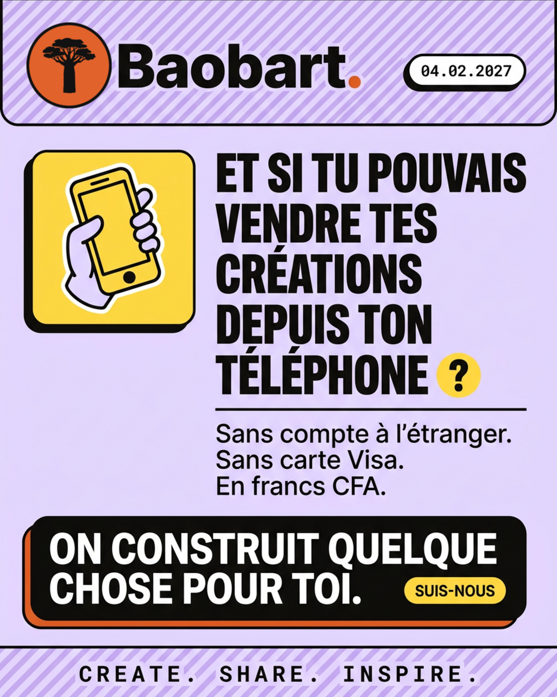

# Post n°1 — lundi 5 octobre 2026

> **Première publication de la campagne.** Semaine 1, semaine de type **A** :
> 🖼️ image le lundi · 🎬 vidéo le mercredi · 🖼️ image le vendredi.
>
> **Contrainte majeure (R1) :** on ne publie pas Baobart. Le produit reste fermé.
> Cette publication **tease** sans ouvrir aucune porte.

---

## 1. La fiche du post

| | |
|---|---|
| **Date** | lundi 5 octobre 2026 |
| **Heure** | 12 h 30 (heure d'Abidjan / Dakar — pause déjeuner, pic d'usage téléphone) |
| **Format** | 🖼️ **Image** — affiche portrait 4:5 |
| **Dimensions** | 1080 × 1350 px (flux Instagram / Facebook) · 1080 × 1920 px (version story, même composition, bandeaux hauts/bas dégagés) |
| **Canaux** | Instagram (feed) · Facebook · TikTok (en statique, avec musique) · LinkedIn (adaptation §5) |
| **Objectif** | Poser le territoire. 300 abonnés, 100 clics vers la liste d'attente |
| **KPI de succès** | Taux d'enregistrement > 2 % · au moins 20 commentaires · 30 partages |

---

## 2. Le concept

**Une affiche-manifeste qui parle de la douleur, pas du produit.**

Le public visé — créatifs d'Afrique de l'Ouest — vit trois frustrations quotidiennes :
chercher le bon fichier pour un brief, livrer un client par WhatsApp, attendre un virement
qui ne vient pas. Le post n°1 nomme ces frustrations à voix haute, annonce que « quelque
chose » est en train d'être construit pour elles, et donne **une seule date** : le
4 février 2027.

**Ce que le post ne fait pas :** il ne nomme pas le produit, ne montre pas d'interface,
ne propose aucun lien vers la plateforme, n'utilise aucun verbe du type « disponible »,
« essaye », « inscris-toi ». Le seul appel à l'action est **suivre le compte** —
parce que c'est la seule action qui existe vraiment à cet instant.

**Pourquoi ça marche :** une date crée l'attente ; une frustration nommée crée la
reconnaissance ; l'absence de produit crée le mystère. Les trois ensemble transforment
un inconnu en quelque chose qu'on attend.

---

## 3. Le texte de l'affiche

### Hiérarchie (4 niveaux, dans cet ordre)

| Niveau | Texte | Traitement |
|---|---|---|
| **1. Accroche** | `ET SI TU POUVAIS VENDRE TES CRÉATIONS DEPUIS TON TÉLÉPHONE ?` | Archivo Black, capitales, 96-110 px, tracking −2,5 px, interlignage 0,93, encre `#121212` |
| **2. Sous-accroche** | `Sans compte à l'étranger. Sans carte Visa. En francs CFA.` | Poppins 600, 44 px, encre, interlignage 1,25 |
| **3. Date** | `04.02.2027` | Space Mono, 40 px, capitales, sur **pastille blanche contourée** posée sur un bloc jaune |
| **4. Signature** | `ON CONSTRUIT QUELQUE CHOSE POUR TOI.` | Poppins 800, 34 px, capitales, blanc sur bloc encre |

### Les quatre accroches, toutes maquettées

| | Accroche | Angle | Affiche |
|---|---|---|---|
| **A** | « Et si tu pouvais vendre tes créations depuis ton téléphone ? » | Le bénéfice, direct | [`affiche A`](2026-10-05-post-01-affiche.png) |
| **B** | « Ton travail mérite mieux qu'un virement en retard. » | La frustration, émotion | [`affiche B`](2026-10-05-post-01-affiche-B.png) |
| **C** | « 485 millions de comptes mobile money. Zéro endroit pour vendre ton art. » | Le chiffre, provocation | [`affiche C`](2026-10-05-post-01-affiche-C.png) |
| **D** | « Le studio partagé de l'Afrique créative. » | Le manifeste, la tagline | [`affiche D`](2026-10-05-post-01-affiche-D.png) |

Les quatre affiches sont produites et conformes au design system (lockup, baseline,
deux accents, contours, ombres dures). **A est validée pour le lundi 5 octobre** ; B, C et
D servent aux semaines suivantes — et le test dit laquelle fonctionne : on mesure les
**partages**, pas les likes (📖 `2026-10-05-post-01-reseaux.md` §4).

---

## 4. La composition (à donner au graphiste)

Fond lavande `#EADFF9`. **Tout est contouré**, trait encre 2,5 px. Ombres dures à 45°,
jamais floues.

```
┌──────────────────────────────────────────────┐
│ ░░░░░░░░░ trame diagonale 135° ░░░░░░░░░░░░░ │
│  (●) Baobart.              ┌────────────┐    │
│   pastille orange          │ 04.02.2027 │    │  lockup à gauche,
│   contour noir,            └────────────┘    │  pastille blanche
│   point orange                              │  à droite (Space Mono)
├──────────────────────────────────────────────┤
│  ┌─────────┐   ET SI TU POUVAIS             │
│  │  main + │   VENDRE TES                   │
│  │téléphone│   CRÉATIONS                    │  Archivo Black,
│  │ (jaune) │   DEPUIS TON                   │  capitales, encre
│  └─────────┘   TÉLÉPHONE ?                  │  sur fond lavande
│                                             │
│  ─────────────────────                      │  filet 2,5 px
│  Sans compte à l'étranger.                  │  Poppins 600
│  Sans carte Visa.                           │
│  En francs CFA.                             │
│                                             │
├──────────────────────────────────────────────┤
│ ┌────────────────────────────────────────┐  │
│ │ ON CONSTRUIT QUELQUE CHOSE POUR TOI.   │  │  bloc encre #121212,
/// │                        ┌───────────┐   │  │  ombre 9px 9px 0 orange
/// │                        │ SUIS-NOUS │   │  │  #E2622C
/// └────────────────────────└───────────└───┘  │
│ ░░░░ CREATE. SHARE. INSPIRE. ░░░░░░░░░░░░░░ │  bandeau bas tramé :
│      Space Mono 700, +0,2 em                │  la baseline officielle
└──────────────────────────────────────────────┘
```

**Les règles du design system appliquées ici** (📐 planches 00, 01, 03 et 05) :

1. **Deux accents maximum à l'écran** : le jaune (illustration, pastille de date, bouton)
   et l'orange (point du logo, ombre du bloc encre). Le lavande est un **fond**, pas un
   accent.
2. **Le jaune n'est jamais du texte** — il est toujours un fond. Le texte sur jaune est
   encre.
3. **Tout est contouré** : pastille, blocs, illustration, filets. Aucune surface flottante
   sans trait encre (2 px petits éléments, 2,5 px cartes, 3 px grandes surfaces).
4. **Ombres dures à 45°**, jamais floues : `4px 4px 0 #121212` sur les blocs clairs,
   `9px 9px 0 #E2622C` sur le bloc noir — **l'ombre colorée est réservée aux blocs noirs**.
5. **Le lockup respecte la zone de protection** : une demi-largeur de pastille sur les
   quatre côtés, aucun élément ne s'y invite.
6. **La baseline `CREATE. SHARE. INSPIRE.`** se pose en Space Mono 700, letter-spacing
   +0,2 em, et ne descend jamais sous 9 px.

---

## 5. Le texte de publication (caption)

### Instagram / Facebook / TikTok

> Tu passes combien de temps à chercher le bon fichier pour un brief ?
>
> Combien de messages WhatsApp pour livrer un client ?
> Combien de « je te fais le virement demain » que tu n'as jamais vus arriver ?
>
> On est en train de construire quelque chose pour toi.
> Un endroit où tu publies ton travail, où les autres le découvrent, et où tu encaisses.
> En francs CFA. Sur ton numéro.
>
> On ne l'ouvre pas aujourd'hui.
> On ouvre le 4 février 2027.
>
> D'ici là, on te montre tout : ce qu'on construit, pourquoi, et comment.
> Si tu crées en Afrique de l'Ouest, suis-nous. Tu seras là le premier jour.
>
> — l'équipe

**Règles respectées** (📖 charte §9) : tutoiement partout · phrases < 20 mots · une seule
idée par paragraphe · **zéro émoji** · un seul point d'exclamation dans tout le texte
(ici : aucun) · aucune promesse de disponibilité.

### LinkedIn (adaptation, même jour)

> En Afrique de l'Ouest, il y a 485 millions de comptes mobile money enregistrés.
>
> Et toujours aucun endroit où un créatif peut publier son travail, le faire découvrir,
> et se faire payer dans sa monnaie.
>
> On construit cette plateforme. On l'ouvre le 4 février 2027.
>
> D'ici là, on documente tout ici : ce qu'on fait, ce qu'on apprend, ce qu'on rate.
>
> Si vous êtes une agence, une école de design ou un créatif, et que ce sujet vous
> concerne : on veut vous parler.

*(LinkedIn passe au « vous » — c'est le seul canal où la charte l'autorise, §6.)*

### WhatsApp / chaîne (même jour, 18 h)

> Premier message. On construit quelque chose pour les créatifs d'Afrique de l'Ouest.
> On ouvre le 4 février 2027. D'ici là, on te montre tout ici. Un message par semaine,
> pas plus.

---

## 6. La version Story (1080 × 1920)

Même composition, avec deux bandeaux dégagés en haut et en bas (zones sûres iOS/Android) :

- **Bandeau haut :** pastille « 04.02.2027 » + `NOUVEAU COMPTE`
- **Centre :** l'accroche, 3 lignes maximum, plus grosse que sur le post
- **Bandeau bas :** sticker sondage `Tu vends déjà tes créations en ligne ?` — deux
  réponses : `Oui` / `Pas encore`
- **Pas de lien** (il n'y a rien à lier aujourd'hui)

---

## 7. La checklist avant de publier

- [ ] L'accroche tient en **3 lignes** sur un écran de téléphone, sans être coupée
- [ ] Aucun mot du type « disponible », « en ligne », « essaye », « nouveau »
- [ ] Aucun lien vers la plateforme (le compte n'a qu'un lien : la liste d'attente)
- [ ] La date écrite est **04.02.2027**, coché avec la date de publication réelle
- [ ] Deux accents maximum à l'écran ; le jaune n'est pas du texte
- [ ] Toutes les surfaces sont contourées ; ombres dures, pas de flou
- [ ] Sous-titres présents si une musique ou une vidéo accompagne l'image
- [ ] Relu par **deux personnes** (📖 charte §9 : fond + ton)
- [ ] Le test en trois questions de §7.6 du calendrier est passé

---

## 8. Le post suivant — mercredi 7 octobre (🎬 vidéo)

Pour que l'alternance soit concrète dès la première semaine :

| | |
|---|---|
| **Format** | Vidéo verticale 1080 × 1920, 30-40 s, sous-titrée |
| **Contenu** | Démo filmée à l'écran : une ressource est déposée, publiée, apparaît dans le flux, reçoit un like. Aucune voix off — musique + sous-titres + stickers |
| **Source** | Les captures d'écran réelles du produit (`Baobart Design/uploads/screencapture-baobart-*`) ou un enregistrement d'écran de la démo |
| **Le point de vigilance** | Aucune URL visible, aucun logo en gros plan, aucun bouton « S'inscrire » à l'écran |
| **Le dernier plan** | Pastille blanche : `04.02.2027` — puis l'écran revient au compte |

---

## 9. Décisions prises et points encore ouverts

### ✅ Décisions actées (05/10/2026)

1. **« Sans publier Baobart » = le produit reste fermé, la marque peut être nommée.**
   Les posts sont signés par le compte, parlent de ce qu'on construit, mais **aucun accès
   à la plateforme n'est possible avant le 4 février 2027**. La couche « nom de la marque »
   de l'affiche (§4, règle 5) est donc **activée**.
2. **Le format du post n°1 est une image** (affiche 4:5) — semaine de type A.
3. **Le produit n'est jamais montré comme disponible** : voir les règles du teasing,
   §7.6 du calendrier.

### ⏳ Points encore ouverts

1. **Le lien en bio** : vers la page d'attente (recommandé) ou vide au départ ?
   → Recommandation : **page d'attente dès le jour 1**, c'est le seul endroit qui existe
   vraiment et le seul endroit où l'audience se transforme en actif possédé.
2. **Le branding à appliquer** : voir la note ci-dessous.

---

## ✅ Design system — reçu et appliqué

Le design system officiel a été transmis le 5 octobre 2026 sous forme de **planches
images** (00 · Logo, 01 · Couleurs, 02 · Typographie, 03 · Contours/rayons/ombres,
04 · Composants, 05 · Règles d'usage). Il est transcrit dans le document canonique :

> **📐 [`Doc/DESIGN_SYSTEM_BAOBART.md`](../../DESIGN_SYSTEM_BAOBART.md)** — *Baobart.
> Sticker System, document de référence.* En cas de contradiction avec tout autre
> document du dépôt, **c'est celui-ci qui gagne.**

Les points qui ont directement façonné ce post :

| Élément | Règle officielle | Application sur l'affiche |
|---|---|---|
| **Logo** | Pastille orange, contour noir, `Baobart.` en Archivo Black, **point orange** | Lockup en haut à gauche du bandeau tramé |
| **Baseline** | `CREATE. SHARE. INSPIRE.` en Space Mono 700, +0,2 em, jamais sous 9 px | Bandeau bas, centré |
| **Couleurs** | 2 fonds, 2 accents, 1 noir — jamais plus de 2 accents par écran | Lavande fond + jaune + orange (2 accents) + encre |
| **Contours** | Tout est contouré, 2/2,5/3 px | Pastille, blocs, illustration, filets |
| **Ombres** | Dures, à 45°, jamais floues ; ombre colorée **réservée aux blocs noirs** | Ombre encre sur les blocs clairs, ombre orange sur le bloc noir |
| **Texte** | Titres en capitales, Archivo Black, tracking négatif | Les 5 lignes du titre |
| **Trames** | Diagonale 135° + libellé sur pastille blanche contournée | Bandeaux haut et bas, pastille de date |


---

## 10. Les maquettes (produites le 05/10/2026)

**Quatre affiches, même système :**

| Var. | Fichier | Direction | Illustration |
|---|---|---|---|
| **A** | [`2026-10-05-post-01-affiche.png`](2026-10-05-post-01-affiche.png) | Bénéfice | Main + smartphone sur bloc jaune |
| **B** | [`2026-10-05-post-01-affiche-B.png`](2026-10-05-post-01-affiche-B.png) | Frustration | Horloge triste + smartphone |
| **C** | [`2026-10-05-post-01-affiche-C.png`](2026-10-05-post-01-affiche-C.png) | Chiffre | Chiffre-héro « 485 MILLIONS » |
| **D** | [`2026-10-05-post-01-affiche-D.png`](2026-10-05-post-01-affiche-D.png) | Manifeste | Chevalet, tablette graphique, pot de peinture |

### 10.1 L'affiche retenue pour lundi (variante A)

**Fichier :** [`2026-10-05-post-01-affiche.png`](2026-10-05-post-01-affiche.png)



| | |
|---|---|
| **Dimensions** | 928 × 1152 px (ratio 0,806 — proche de 4:5). À réexporter en **1080 × 1350** |
| **Poids** | ~1,3 Mo — à optimiser en JPEG qualité 85 pour la publication (< 400 Ko) |
| **Conformité design system** | Lockup officiel ✓ · baseline ✓ · 2 accents max ✓ · tout contouré ✓ · ombres dures ✓ |

### Ce que la maquette contient

1. **Bandeau haut tramé 135°** : à gauche le **lockup** (pastille orange à contour noir
   contenant le baobab + `Baobart.` en Archivo Black à **point orange**), à droite la
   pastille blanche contourée `04.02.2027` en Space Mono
2. **Illustration sticker** : main contourée tenant un smartphone, sur bloc jaune
3. **Titre en 5 lignes** : `ET SI TU POUVAIS VENDRE TES CRÉATIONS DEPUIS TON TÉLÉPHONE ?`
   (le point d'interrogation dans un cercle jaune)
4. **Filet noir** + les trois lignes de sous-accroche
5. **Bloc encre** à ombre orange dure : `ON CONSTRUIT QUELQUE CHOSE POUR TOI.` + pastille
   jaune `SUIS-NOUS`
6. **Bandeau bas tramé** : la baseline officielle `CREATE. SHARE. INSPIRE.` en Space Mono
   700, letter-spacing +0,2 em

### 10.2 Les corrections à porter sur les variantes B et D

Relevées à la relecture des maquettes du 05/10/2026 :

| Var. | Défaut | Correction |
|---|---|---|
| **B** | Le titre s'écrit `TŌN TRAVAIL` — accent circonflexe parasites sur le O | Écrire **TON** (pas d'accent) |
| **B** | L'écran du smartphone affiche un symbole **€** | Remplacer par un montant en **FCFA** (ex. `12 000 F`) — un euro sur une affiche qui parle de francs CFA casse le message |
| **D** | Rien à corriger | — |

*(Ces défauts viennent du rendu automatique des textes dans la maquette. La composition,
les couleurs, les contours et la typo générale sont conformes — seuls ces deux caractères
sont à reprendre à la mise en production.)*

### 10.3 Ce qu'il reste à faire pour passer en production

- [ ] Recomposer aux dimensions finales **1080 × 1350** avec les **vraies polices** de la
      charte (Archivo Black / Poppins / Space Mono) plutôt que des polices approchées
- [ ] Vérifier les valeurs de couleur au pipette : `#EADFF9`, `#FFD84A`, `#E2622C`,
      `#121212`, `#FFFFFF`
- [ ] Vérifier la **zone de protection** du lockup (une demi-largeur de pastille sur les
      quatre côtés)
- [ ] Vérifier le **letter-spacing** de la baseline (+0,2 em) et qu'elle ne descend pas
      sous 9 px
- [ ] Décliner la **version story** 1080 × 1920 (bandeaux sûrs iOS/Android dégagés)
- [ ] Exporter en JPEG optimisé
- [ ] Relire par deux personnes (📖 charte §9)

### Les deux variantes d'accroche à tester (semaines 2-3)

La maquette utilise la variante **A**. Les variantes **B** (« Ton travail mérite mieux
qu'un virement en retard. ») et **C** (« 485 millions de comptes mobile money. Zéro endroit
pour vendre ton art. ») se composent sur le même gabarit — seule la zone de titre change.
